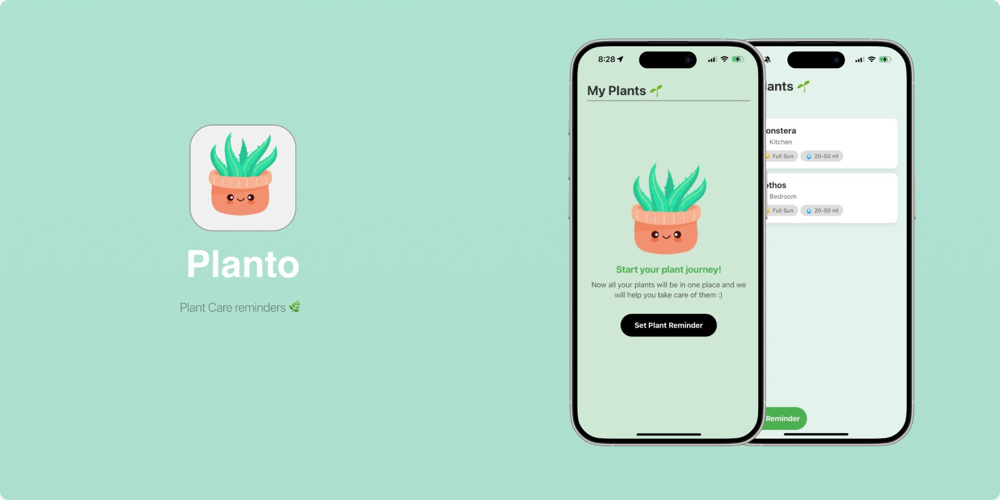

# **Plants-App-**


# **Planto**  
A smart plant care reminder app to help you keep your plants healthy and happy  


---

## **Description**  
**Planto** is a simple and user-friendly app designed to assist plant enthusiasts in taking care of their plants. With Planto, you can:  
- Add the names of your plants and assign their locations (e.g., bedroom, kitchen, balcony).  
- Set reminders for light requirements (fully or partially lit).  
- Schedule watering based on frequency and specify the exact water amount in milliliters (ml).  

Planto ensures your plants receive the care they need, making plant care effortless and enjoyable.  

---

## **Features**  
- **Plant Management**: Add plants and assign them to specific locations.  
- **Light Requirements**: Set the light preference for each plant: fully or partially lit.  
- **Water Scheduling**: Choose how often to water your plants and specify the water amount in milliliters.  

---

## **Usage**  
1. **Add a Plant**:  
   - Enter the plant’s name (e.g., Monstera, Succulent).  
   - Assign a location (e.g., bedroom, kitchen, balcony).  

2. **Set Light Preferences**:  
   - Choose between full sunlight (**Fully**) or partial sunlight (**Partially**).  

3. **Set Watering Preferences**:  
   - Schedule how often the plant needs water (e.g., every 3 days, weekly).  
   - Specify the amount of water in milliliters (e.g., 200 ml).  

---

## **Screen Structure**  
The app consists of the following screens:  

### 1. **Welcome Screen**  
   - Contains two primary actions:  
     - **Login**: Navigate to the Login Screen.  
     - **Sign Up**: Navigate to the Sign Up Screen.  

---

### 2. **Login Screen**  
   - Allows users to log in using their email and password.  
   - **Fields**:  
     - **Email**: Input for the user's email.  
     - **Password**: Input for the user's password (must be more than 6 characters).  
   - **Features**:  
     - Validation for password length.  
     - Option to **Reset Password** if the user forgets their credentials.  

---

### 3. **Sign Up Screen**  
   - Enables new users to create an account.  
   - **Fields**:  
     - **Full Name**: Input for the user's full name.  
     - **Email**: Input for the user's email.  
     - **Password**: Input for the user's password (must be more than 6 characters).  

---

### 4. **Set Reminder Screen**  
   - Allows users to create reminders for plant care.  
   - **Fields**:  
     - **Plant Name**: Input for the name of the plant.  
     - **Location**: Input for the plant's location.  
     - **Amount of Water**: Input for the required water amount.  
     - **Sunlight**: Input for the amount of sunlight required.  
   - **Features**:
     - Users can save reminders for their plants.  

---

### 5. **Check Reminder Screen**  
   - Displays a list of saved reminders.  
   - Users can mark reminders as completed once finished.

  ## Setup Instructions

### Clone the Repository
To get started, clone the repository by running the following command in your terminal:
```sh
git clone https://github.com/Noura-sun/Plants-App-.git
cd Plants-App-
```

### Install Dependencies
Ensure that you have [Node.js](https://nodejs.org/) installed along with either [npm](https://www.npmjs.com/) or [Yarn](https://yarnpkg.com/). Then, install the required dependencies:
```sh
npm install  # or yarn install
```

### Running the Application

#### Android
To run the app on an Android emulator or physical device, use:
```sh
npx react-native run-android
```

#### iOS
To run the app on iOS, follow these steps:
1. Navigate to the `ios` directory and install dependencies using CocoaPods:
   ```sh
   cd ios
   pod install
   cd ..
   ```
2. Run the application:
   ```sh
   npx react-native run-ios
   ```

### Important Notes
- Ensure that Metro Bundler is running before launching the app:
  ```sh
  npx react-native start
  ```
- If you encounter issues, make sure that React Native CLI and the required development environment are properly set up by following the official [React Native environment setup guide](https://reactnative.dev/docs/environment-setup).


## ** Future Work for the Indoor Plant Care Application:**
**We plan to introduce several advanced features to improve the Indoor Plant Care Application:**

 -**Automatic Plant Recognition**
 
Utilize AI-powered image recognition to identify plants through the camera and automatically retrieve relevant care information.

- **Interactive User Community**
  
Integrate a forum or community platform where users can share experiences, tips, and troubleshooting advice related to plant care.

-**Plant Health Analysis via Images**

Implement an AI-driven image analysis tool to detect plant diseases, nutrient deficiencies, and other health issues, providing users with actionable recommendations.


